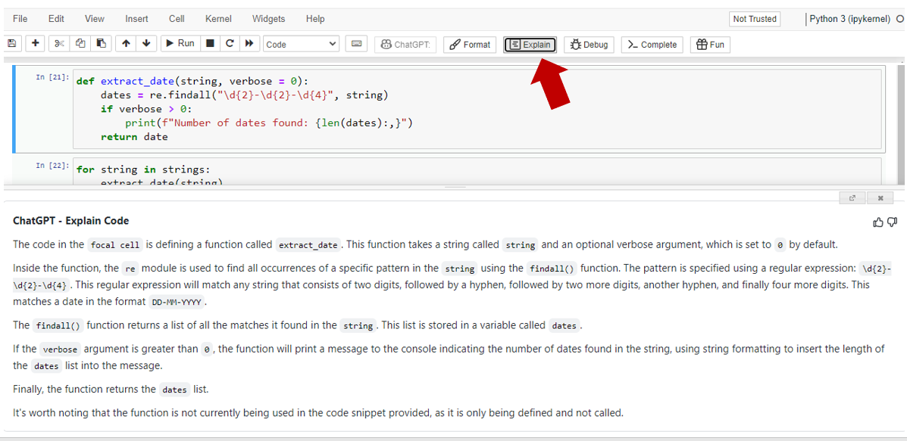
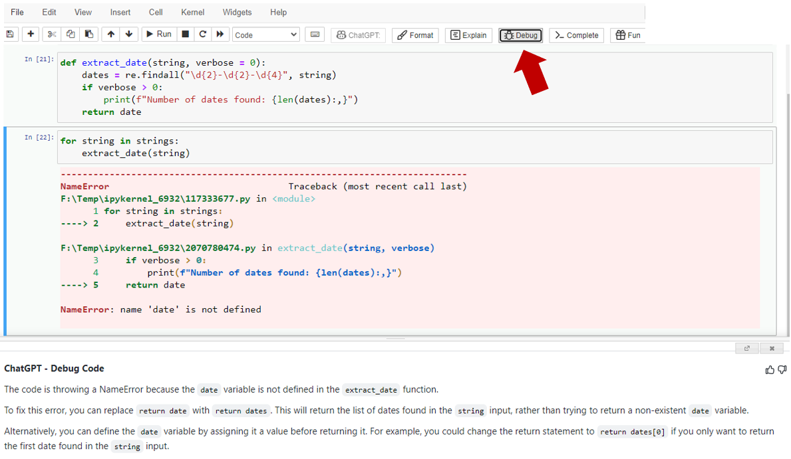
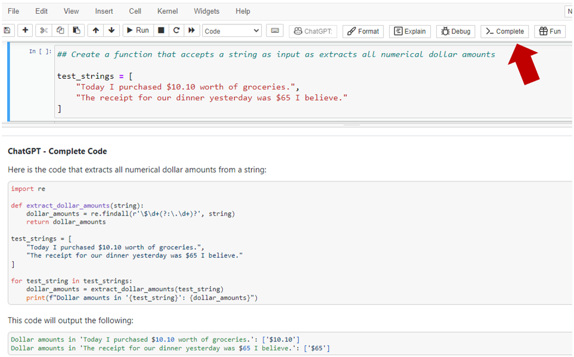
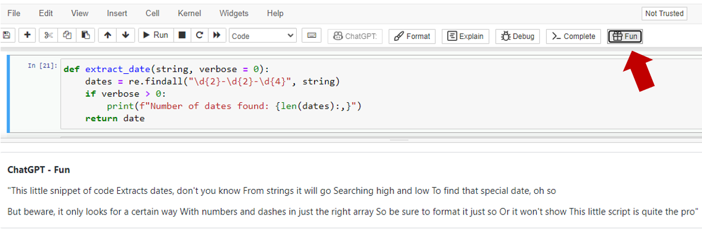

# ChatGPT for Jupyter

A browser extension to provide various helper functions in Jupyter Notebooks, powered by ChatGPT.

Primary functions, have ChatGPT:

- **Format** - Automatically add comments, docstrings, and formatting to your code cell.
- **Explain** - Explain the content of your code cell, ELI5 style.
- **Debug** - Help you debug an error message in your code cell.
- **Complete** - Help you complete a code snippet in your code cell.
- **Fun** - Generate a poem, meme, or joke based on your code (because why not?).

**Project status:** Beta - Bugs likely - If you run into issues or have feature suggestions --> Submit them as an issue!

**Major acknowledgements:** 

- [ChatGPT](https://openai.com/blog/chatgpt/) for doing all the heavy lifting. 
- [wong2/chat-gpt-google-extension](https://github.com/wong2/chat-gpt-google-extension) for serving as a base for the extension. The entire backend integration with ChatGPT is built by them and I use it as-is (including the readme instructions below). It is phenomenal work and I highly recommend checking it out.

## Screenshots

**ChatGPT - Format**   

**ChatGPT - Explain**    

**ChatGPT - Debug**     

**ChatGPT - Complete**    

**ChatGPT - Fun**    

## Installation

### Install to Chrome/Edge

#### Install from Chrome Web Store (Preferred)

Not yet available, waiting for approval.

#### Local Install

1. Download `chromium.zip` from [Releases](https://github.com/TiesdeKok/chat-gpt-jupyter-extension/releases).
2. Unzip the file.
3. In Chrome/Edge go to the extensions page (`chrome://extensions` or `edge://extensions`).
4. Enable Developer Mode.
5. Drag the unzipped folder anywhere on the page to import it (do not delete the folder afterwards).

### Install to Firefox

#### Local Install

1. Download `firefox.zip` from [Releases](https://github.com/TiesdeKok/chat-gpt-jupyter-extension/releases).
2. Unzip the file.
3. Go to `about:debugging`, click "This Firefox" on the sidebar.
4. Click "Load Temporary Add-on" button, then select any file in the unzipped folder.

## Build from source

1. Clone the repo
2. Install dependencies with `npm`
3. `npm run build`
4. Load `build/chromium/` or `build/firefox/` directory to your browser

## Caveats & Warnings

- ChatGPT is amazing, however, it is not perfect and it does make mistakes. I consider ChatGPT to be a "keep your hands on the wheel and look at the road at all times" type of situation. You cannot blindly rely on it. Don't be surprised if it does any of the following:
    - Modify your code in unexpected ways
    - Generate code that does not work
    - Provide incorrect explanations & error explanations
    - Incorrectly highlight correct code as incorrect

**For best results you might have to try a few times, different tries can give different results.**

## Issues & Feature requests

Please report any issues or feature requests on the GitHub Issue tab. I will try to respond as soon as possible!

## Outstanding items & Future plans

- [ ] Add Jupyter Lab support   
- [ ] Add Google Colab support
- [ ] Add shortcuts  
- [ ] Add interupt button   
- [ ] Allow for custom prompts 
